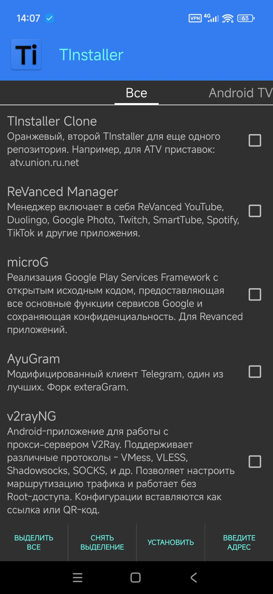

# 🟦 Репозитории с приложениями для приложения TInstaller

> Инструкция:
> 
> Скачать сам TInstaller можно по ссылке с моего домена - https://t.union.ru.net , либо из открытых источников, либо кнопкой ниже.
> 
> [](https://github.com/maksim-ignatov/tinstaller-repository/releases/download/latest/TInstaller.apk)

В приложении вбиваем адрес репозитория:
| Платформа | Адрес репозитория | Описание |
|:---------:|-------------------|----------|
| 📱 | ```apk.union.ru.net``` | Мобильные приложения |
| 📺 | ```atv.union.ru.net``` | Android TV приложения |

| Приложение | Скачиваний |
| ---------- | ---------- |
| AyuGram |  |
| X-plore (mod) |  |
| RBTV+ (mod) |  |
| tTorrent (mod) |  |
| TrueCaller (mod) |  |

Скриншоты:
|  |  |
|:-------:|:-------:|
