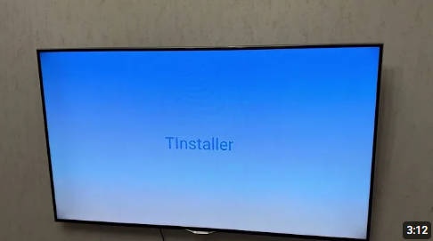
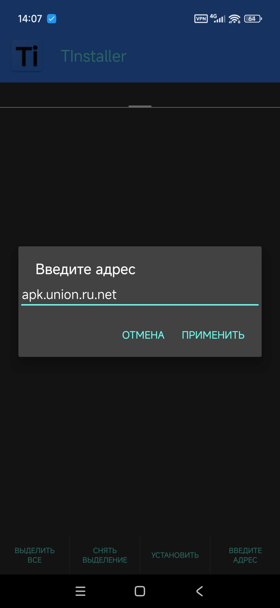
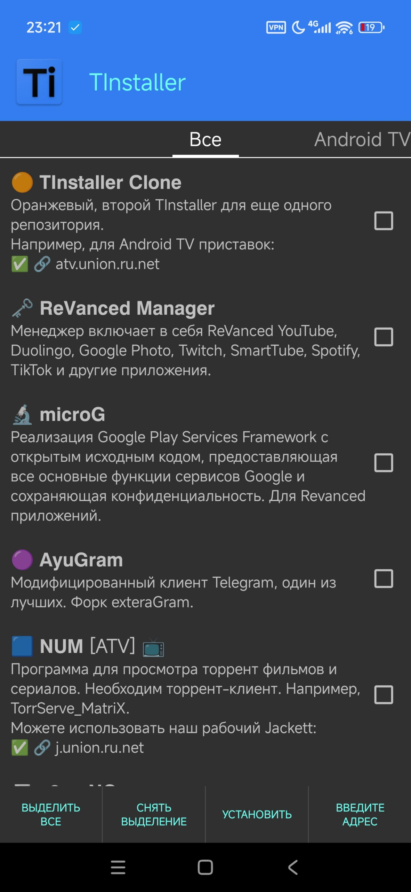
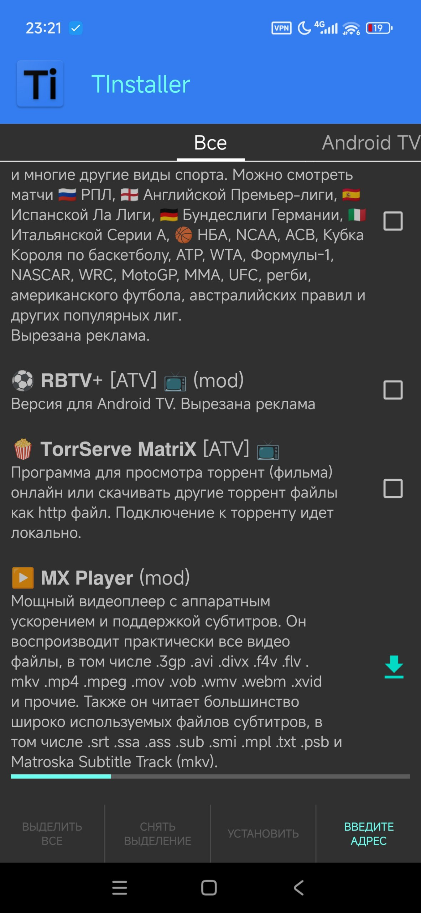

# 🟦 Репозитории с приложениями для TInstaller

> [!NOTE]
> 
> Скачать сам TInstaller можно по ссылке с моего домена - https://t.union.ru.net , либо из открытых источников, либо кнопкой ниже.
> 
> [](https://github.com/maksim-ignatov/tinstaller-repository/releases/download/latest/TInstaller.apk)
>
> Коротко, что это за приложение:
> 
> [](https://www.youtube.com/watch?v=p1Bunre7XRY)

В приложении вбиваем адрес репозитория:
| Платформа | Адрес репозитория | Описание |
|:---------:|-------------------|----------|
| 📱 | ```apk.union.ru.net``` | [Приложения для смартфона](#apk) |
| 📺 | ```atv.union.ru.net``` | [Android TV приложения](#atv) |
---
## <a id="apk">Приложения для смартфона</a>
[](https://uptime.betterstack.com/?utm_source=status_badge)

Tinstaller можно использовать не только для телевизора, но и для смартфона.

Неполный список что внутри `apk.union.ru.net`:
| Приложение | Скачиваний |
| ---------- | ---------- |
| AyuGram |  |
| X-plore (mod) |  |
| RBTV+ (mod) |  |
| TrueCaller (mod) |  |
| TorrServe_MatriX ATV |  |
| RBTV+ ATV (mod) |  |

[См. полный список приложений](applications/README.md)

---
Скриншоты:
|  |  |  |
|:-------:|:-------:|:-------:|

## <a id="atv">Android TV приложения</a>
Короткая ссылка использует редирект на популярный обновляемый источник.

`https://topperbg.github.io/1.json`

---

## FAQ

**Вопрос: У меня не качаются приложения, появляется восклицательный знак! Что делать?**

Ответ: Нужно полностью удалить папку `ti` в `Downloads` или `Загрузки` на Android устройстве и перезагрузить приложение `TInstaller`.
